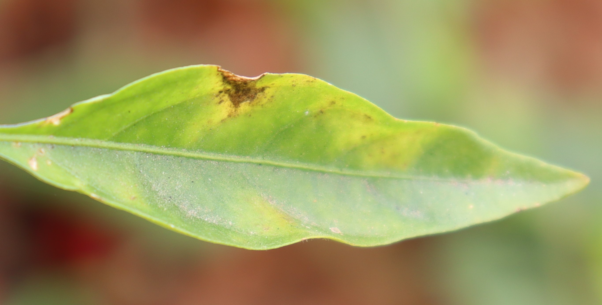
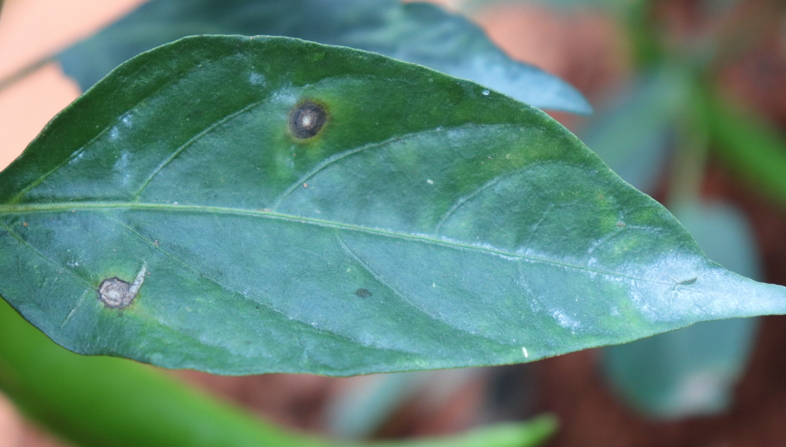
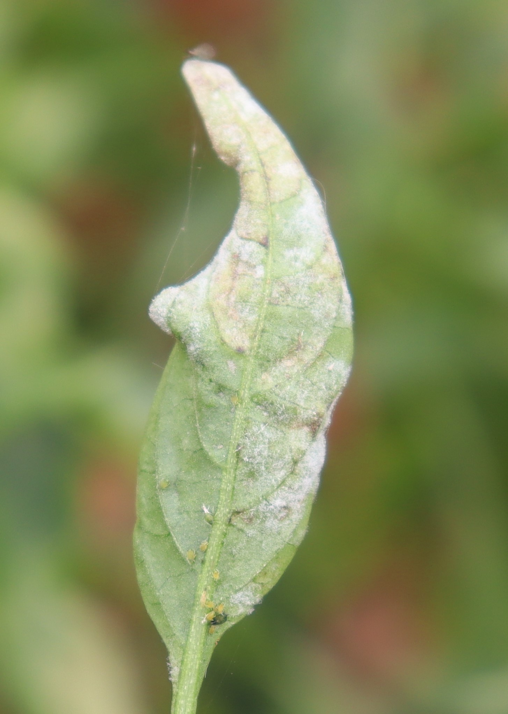
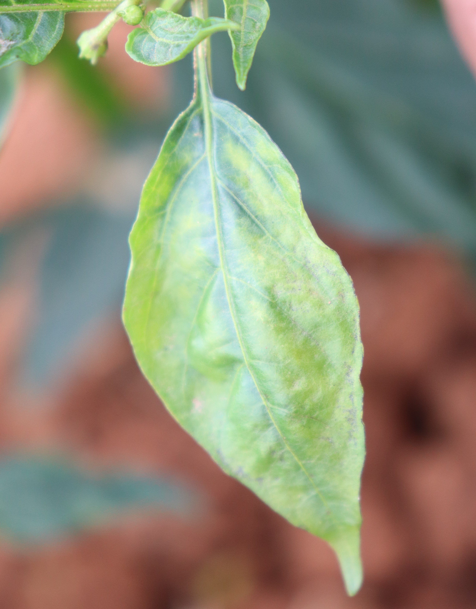
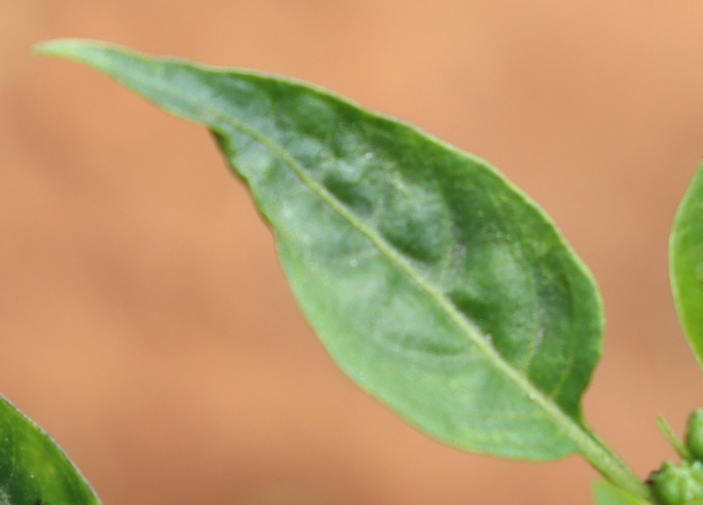

# Chilli Leaf Disease Classification Dataset

[](https://creativecommons.org/licenses/by/4.0/)
[](#changelog)

A comprehensive dataset of chilli leaf images for disease classification, collected and organized for computer vision and deep learning research in agricultural applications. This dataset follows the standardized dataset structure specification.

- Project page: `https://data.mendeley.com/public-files/datasets/tf9dtfz9m6/files/71452a49-947d-4b1f-a898-d51c8e351a53/file_downloaded`
- Original dataset: Chilli leaf disease classification dataset from Mendeley Data

## TL;DR
- Task: classification
- Modality: RGB
- Platform: handheld/field
- Real/Synthetic: real
- Images: 528 images across 5 disease/health categories
- Resolution: Variable (typically high resolution, 700-4500 pixels)
- Annotations: per-image CSV and JSON; COCO format available
- License: CC BY 4.0 (see LICENSE)
- Citation: see below

## Table of contents
- [Download](#download)
- [Dataset structure](#dataset-structure)
- [Sample images](#sample-images)
- [Annotation schema](#annotation-schema)
- [Stats and splits](#stats-and-splits)
- [Quick start](#quick-start)
- [Evaluation and baselines](#evaluation-and-baselines)
- [Datasheet (data card)](#datasheet-data-card)
- [Known issues and caveats](#known-issues-and-caveats)
- [License](#license)
- [Citation](#citation)
- [Changelog](#changelog)
- [Contact](#contact)

## Download
- Original dataset: `https://data.mendeley.com/public-files/datasets/tf9dtfz9m6/files/71452a49-947d-4b1f-a898-d51c8e351a53/file_downloaded`
- This repo hosts structure and conversion scripts only; place the downloaded folders under this directory.
- Local license file: see `LICENSE` (Creative Commons Attribution 4.0 International).

## Dataset structure

This dataset follows the standardized dataset structure specification with subcategory organization for classification tasks:

```
chilli_leaf_classification/
├── chillies/                        # Main category directory
│   ├── healthy/                    # Subcategory: healthy leaves
│   │   ├── csv/                    # CSV annotations per image
│   │   ├── json/                   # Original JSON annotations
│   │   ├── images/                 # Image files (JPG/JPEG)
│   │   └── sets/                   # Dataset split files for healthy
│   │       ├── train.txt
│   │       ├── val.txt
│   │       ├── test.txt
│   │       ├── all.txt
│   │       └── train_val.txt
│   ├── cercospora/                 # Subcategory: cercospora leaf spot
│   │   ├── csv/
│   │   ├── json/
│   │   ├── images/
│   │   └── sets/                   # Dataset split files for cercospora
│   │       ├── train.txt
│   │       ├── val.txt
│   │       ├── test.txt
│   │       ├── all.txt
│   │       └── train_val.txt
│   ├── murda_complex_mites_trips/   # Subcategory: murda complex (mites, trips)
│   │   ├── csv/
│   │   ├── json/
│   │   ├── images/
│   │   └── sets/                   # Dataset split files
│   ├── nutritional/                 # Subcategory: nutritional deficiency
│   │   ├── csv/
│   │   ├── json/
│   │   ├── images/
│   │   └── sets/                   # Dataset split files
│   ├── powdery_mildew/              # Subcategory: powdery mildew
│   │   ├── csv/
│   │   ├── json/
│   │   ├── images/
│   │   └── sets/                   # Dataset split files
│   └── labelmap.json               # Label mapping for all subcategories
├── annotations/                     # COCO format JSON (generated)
│   ├── chillies_instances_train.json
│   ├── chillies_instances_val.json
│   └── chillies_instances_test.json
├── scripts/
│   └── convert_to_coco.py          # Convert CSV to COCO format
├── data/                            # Original data directory
│   └── origin/                     # Original data structure (kept for reference)
│       ├── cropped/
│       ├── cropped_extracted/
│       ├── cropped_resized/
│       ├── cropped_resized_extracted/
│       ├── resized_ram image/
│       ├── resized_ram_extracted/
│       ├── extract_rar.py
│       └── generate_coco_annotations.py
├── LICENSE
├── README.md
└── requirements.txt
```

- Splits: Splits provided via `chillies/{subcategory}/sets/*.txt`. Each subcategory (healthy, cercospora, murda_complex_mites_trips, nutritional, powdery_mildew) has its own split files. List image basenames (no extension). If missing, all images are used.

## Sample images

Below are example images from this dataset. Paths are relative to this README location.

<table>
  <tr>
    <th>Category</th>
    <th>Sample</th>
  </tr>
  <tr>
    <td><strong>Healthy</strong></td>
    <td>
      
      <div align="center"><code>chillies/healthy/images/IMG_5597.JPG</code></div>
    </td>
  </tr>
  <tr>
    <td><strong>Cercospora</strong></td>
    <td>
      
      <div align="center"><code>chillies/cercospora/images/IMG_4045.JPG</code></div>
    </td>
  </tr>
  <tr>
    <td><strong>Powdery Mildew</strong></td>
    <td>
      
      <div align="center"><code>chillies/powdery_mildew/images/IMG_5483.jpg</code></div>
    </td>
  </tr>
  <tr>
    <td><strong>Nutritional</strong></td>
    <td>
      
      <div align="center"><code>chillies/nutritional/images/IMG_3028_3.jpg</code></div>
    </td>
  </tr>
  <tr>
    <td><strong>Murda Complex</strong></td>
    <td>
      
      <div align="center"><code>chillies/murda_complex_mites_trips/images/1.jpg</code></div>
    </td>
  </tr>
</table>

## Annotation schema
- CSV per-image schemas (stored under `chillies/{subcategory}/csv/` folder):
  - Columns include `#item, x, y, width, height, label` (bounding boxes in absolute pixel coordinates).
  - For classification tasks, each image has a full-image bounding box `[0, 0, image_width, image_height]` with the category label.
- JSON per-image schemas (stored under `chillies/{subcategory}/json/` folder):
  - Each image has a corresponding JSON file with COCO-style format
  - Bounding boxes: `[x, y, width, height]` in absolute pixel coordinates
  - For classification tasks, annotations typically cover the entire image
- COCO-style (generated):
```json
{
  "info": {"year": 2025, "version": "1.0.0", "description": "Chilli Leaf Disease Classification chillies train split", "url": "https://data.mendeley.com/public-files/datasets/tf9dtfz9m6/files/71452a49-947d-4b1f-a898-d51c8e351a53/file_downloaded"},
  "images": [{"id": 1, "file_name": "chillies/healthy/images/IMG_5597.JPG", "width": 2730, "height": 1383}],
  "categories": [
    {"id": 1, "name": "healthy", "supercategory": "chilli_leaf"},
    {"id": 2, "name": "cercospora", "supercategory": "chilli_leaf"},
    {"id": 3, "name": "murda_complex_mites_trips", "supercategory": "chilli_leaf"},
    {"id": 4, "name": "nutritional", "supercategory": "chilli_leaf"},
    {"id": 5, "name": "powdery_mildew", "supercategory": "chilli_leaf"}
  ],
  "annotations": [{"id": 1, "image_id": 1, "category_id": 1, "bbox": [0, 0, 2730, 1383], "area": 3775590, "iscrowd": 0}]
}
```

- Label maps: `chillies/labelmap.json` defines the category mapping for all 5 subcategories.

## Stats and splits

**Dataset Statistics**:
- Total images: 528
- Categories: 5 (healthy, cercospora, murda_complex_mites_trips, nutritional, powdery_mildew)
- Training set: 316 images (`chillies/sets/train.txt`)
- Validation set: 105 images (`chillies/sets/val.txt`)
- Test set: 107 images (`chillies/sets/test.txt`)

**Category Distribution**:
- Healthy: 69 images
- Cercospora: 152 images
- Murda Complex (mites, trips): 107 images
- Nutritional: 102 images
- Powdery Mildew: 102 images

- Splits provided via `chillies/{subcategory}/sets/*.txt`. Each subcategory has its own split files. You may define your own splits by editing those files.

## Quick start

Python (COCO):
```python
from pycocotools.coco import COCO
coco = COCO("annotations/chillies_instances_train.json")
img_ids = coco.getImgIds()
img = coco.loadImgs(img_ids[0])[0]
ann_ids = coco.getAnnIds(imgIds=img['id'])
anns = coco.loadAnns(ann_ids)
```

Convert to COCO JSON:
```bash
python scripts/convert_to_coco.py --root . --out annotations --category chillies --splits train val test
```

Dependencies:
```bash
python -m pip install pillow
```

Optional for the COCO API example:
```bash
python -m pip install pycocotools
```

## Evaluation and baselines

This dataset is designed for chilli leaf disease classification tasks. Evaluation metrics typically include:
- Classification accuracy
- Per-class precision, recall, and F1-score
- Confusion matrix analysis

Baseline results will be added as they become available.

## Datasheet (data card)
- Motivation: Chilli leaf disease detection and classification for agricultural AI applications
- Composition: RGB images of chilli leaves with various disease conditions and healthy samples
- Collection process: Images collected from Mendeley Data repository; manually validated
- Preprocessing: Images cropped and resized; annotations generated in COCO format
- Distribution: Dataset available via Mendeley Data
- Maintenance: Maintained by dataset contributors

## Known issues and caveats
- Image format: Images are in JPG/JPEG format with variable resolutions
- File naming: Images follow various naming patterns (e.g., `IMG_5597.JPG`, `IMG_5483.jpg`, `1.jpg`)
- Classification task: This is a classification dataset, so annotations use full-image bounding boxes
- Subcategory naming: Original subcategory "murda complex(mites,trips)" has been standardized to "murda_complex_mites_trips" in the directory structure
- Coordinate system: Origin at top-left corner, units in pixels
- Image count: Some images may be duplicates or variations; total unique images: 528

## License

This dataset is licensed under the Creative Commons Attribution 4.0 International License (CC BY 4.0).

You are free to:
- Share — copy and redistribute the material in any medium or format
- Adapt — remix, transform, and build upon the material for any purpose, even commercially

Under the following terms:
- Attribution — You must give appropriate credit, provide a link to the license, and indicate if changes were made.

For the full legal text, see `LICENSE` file or visit: https://creativecommons.org/licenses/by/4.0/legalcode

## Citation

If you use this dataset, please cite:

```bibtex
@dataset{chilli_leaf_disease_classification,
  title={Chilli Leaf Disease Classification Dataset},
  author={Dataset Contributors},
  year={2025},
  url={https://data.mendeley.com/public-files/datasets/tf9dtfz9m6/files/71452a49-947d-4b1f-a898-d51c8e351a53/file_downloaded},
  license={CC BY 4.0}
}
```

## Changelog

- **V1.0.0** (2025): Initial standardized structure and COCO conversion utility
  - Reorganized dataset into standardized subcategory structure
  - Generated CSV annotations from JSON files
  - Created dataset splits (train/val/test)
  - Added COCO format conversion script
  - Updated README with standard format

## Contact

- Maintainers: Dataset maintainers
- Original authors: See Mendeley Data repository
- Source: `https://data.mendeley.com/public-files/datasets/tf9dtfz9m6/files/71452a49-947d-4b1f-a898-d51c8e351a53/file_downloaded`

## Related Datasets

This dataset is part of a larger collection of agricultural disease classification datasets. Related datasets include:
- Tea leaf disease classification
- Rice disease classification
- Tomato disease classification
- Potato disease classification
- Apple scab disease classification
